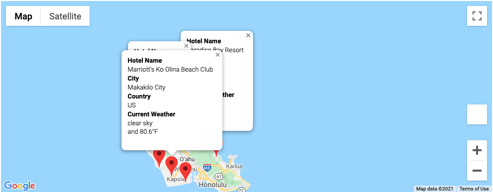
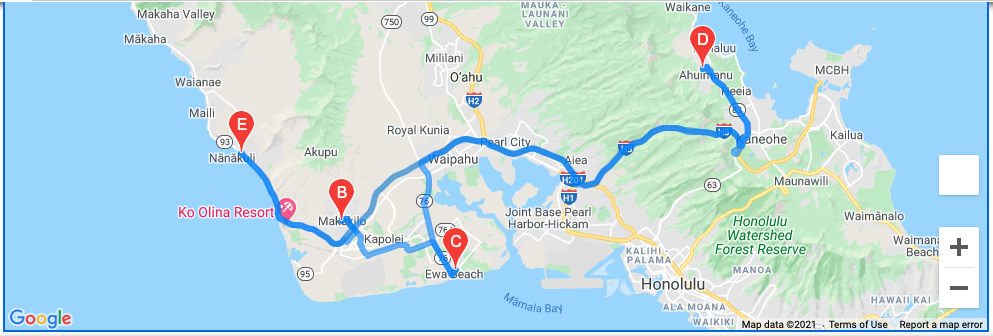
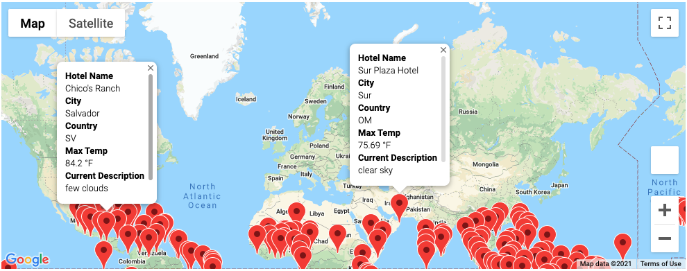

# WeatherPy-

## Overview of Project
We generated a set of random latitudes and longitudes to identify cities for potential vacation locations based on temperatures, using an API call to OpenWeatherMap.  From the dataframe of the locations we identified [hotels](Vacation_Search/WeatherPy_vacation.csv) within those cities. We then narrowed our search to four cities close to each other and using google maps created driving directions.  Additionally, we added a marker layer to our map for easy view of important information such as the hotel name, city, country, and current weather with temperature. 

 

